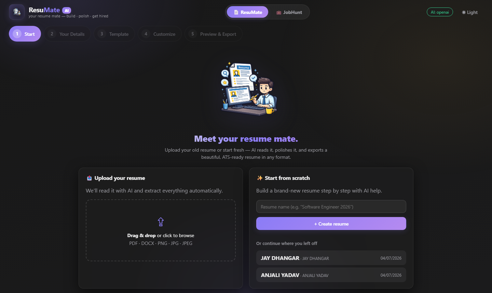
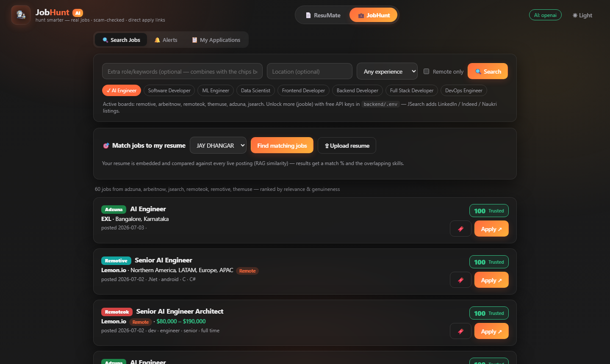
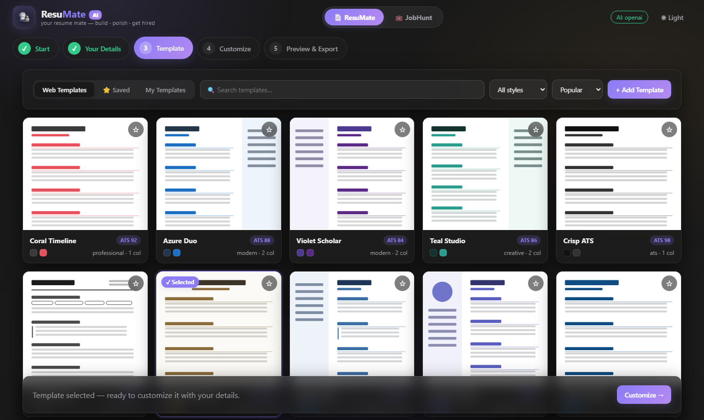
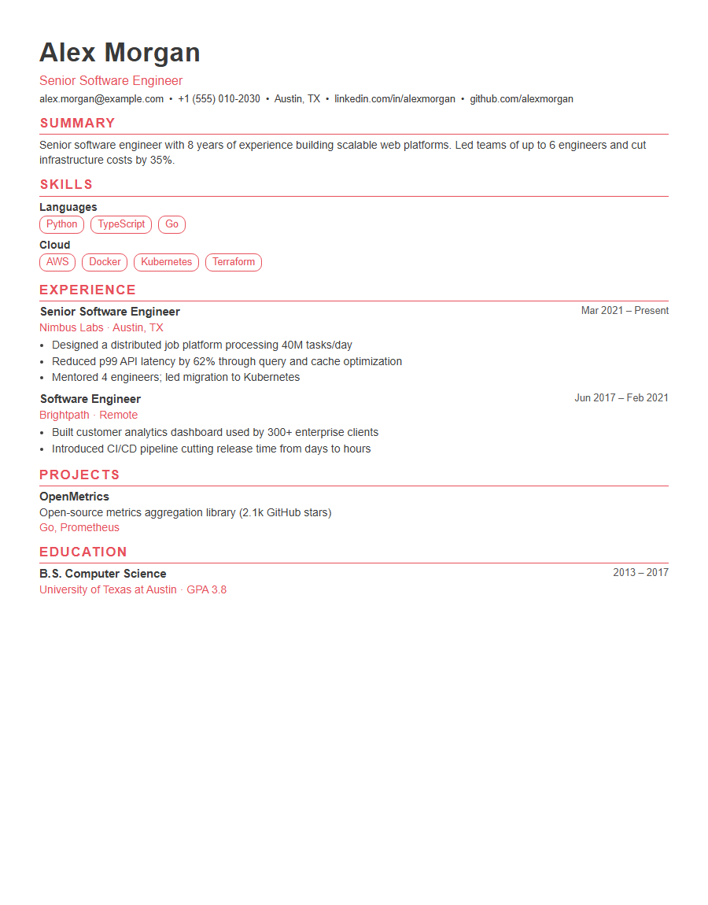

# ResuMate AI 📄 + JobHunt AI 💼

[](https://github.com/JayDhangar/resumate-ai-and-jobhunt-ai/actions/workflows/ci.yml)


Two AI products in one app, switched with the header toggle — shared backend, separate
use cases, each with its own agents and its own theme:

- **ResuMate AI** (purple theme) — *your resume mate: build · polish · get hired.*
  A multi-agent resume builder with a 5-step wizard: upload or start from scratch,
  form-based editing, template gallery, AI customization, and export to PDF / DOCX /
  HTML / PNG / Markdown / JSON.
- **JobHunt AI** (red-orange theme) — *hunt smarter: real jobs · scam-checked · direct
  apply links.* A job-search aggregator that fans out across multiple boards in
  parallel, dedupes, ranks by relevance, scores every posting's genuineness, RAG-matches
  jobs to your resume, and drafts + sends application emails per job.

## Screenshots

| ResuMate AI — start | JobHunt AI — live search |
|---|---|
|  |  |

| Template gallery | Generated resume (sample data) |
|---|---|
|  |  |

## The 5-step builder

1. **Start** — drag & drop your resume (PDF/DOCX/PNG/JPG, with OCR) or create from scratch; continue previous resumes
2. **Your Details** — form-based editing for every section (personal, skills, work history, education, projects, certifications, languages, awards) + live Resume Health scores; raw JSON under "Advanced"
3. **Template** — glass-card gallery with hover **Preview / Use template** actions, full-size sample previews, search / style filter / sort, ⭐ save, and upload-your-own templates
4. **Customize** — structured styling controls (accent color presets **+ full color picker**, sans/serif, columns, spacing, header style) with a debounced live preview, plus free-form AI content edits
5. **Preview & Export** — full-page render, in-place text editing with undo/redo, all six export formats, version save & restore, public share link, and the **🌐 Portfolio generator** (below)

## 🌐 Portfolio website generator

One click in Preview & Export turns your resume into an **animated personal portfolio
website** — a single self-contained HTML file (zero dependencies, no CDN calls) that runs
offline by double-click and deploys anywhere as one file. Pick a design, pick an accent
color (full color-picker), preview live, download.

**Five hand-built designs, each a different personality:**

| Design | Signature moves |
|---|---|
| 🖥 **Neon Terminal** | Boot-typing intro, phosphor glow, CRT scanlines, a **real prompt** recruiters can type into (`help`, `neofetch`, `theme amber`, `matrix`, `sudo hire-me`, ↑ history, Tab completion), and 👾 **pixel bugs crawling the screen**: squash one and it explodes into a skill |
| 🍱 **Bento Studio** | Glass bento grid with 3D-tilt tiles, magnetic buttons, count-up stats, graffiti skill backdrop behind your photo, a **zero-gravity toolbox** (your skills as floating magnets you can grab and throw), cursor spotlight, and 🎁 **click-to-uncover** project tiles |
| ✒️ **Kinetic Ink** | Editorial serif with letter-by-letter name assembly, **magnetic type that dodges your cursor** (the headline letters and a whole skill-word cloud), rotating role line, custom morphing cursor, a **pinned sideways-scrolling project strip**, full-detail lightboxes, and 🩸 click-anywhere **ink splats stamped with your skills** |
| 🌌 **Aurora Glass** | Drifting aurora blobs, **rotating galaxy with shooting stars**, cursor glow, a draggable 3D **skill constellation** (spider-web of your skills), self-drawing timeline — and 8 secret skill-stars hidden in the sky (find them all 🏆) |
| 🧱 **Brutalist Grid** | Hard shadows, slamming clip-path reveals, marquee tickers, wobbling stickers, expanding work rows, an ⚡ Invert button that flips the whole site, and 🧱 **loose bricks in the page edges**: pull one out and it's stamped with a skill before sliding back in |

All designs auto-fill from your resume, respect `prefers-reduced-motion`, sanitize
inputs, and are covered by tests. Files are saved to `backend/generated/portfolios/`.

## JobHunt AI 💼

Toggle to **JobHunt** in the header. Search any role (AI Engineer, Software Developer,
ML Engineer, Data Scientist…), filter by location or remote-only, and get a ranked list
with company, salary (when disclosed), full description, posting date, source and a
**direct apply link**.

**Genuineness score (0–100)** on every posting, with visible reasons: recognized apply
domain (LinkedIn, Indeed, Naukri, Greenhouse, Workday, Lever…), HTTPS, scam-wording
detection (upfront fees, WhatsApp/Telegram recruiting, free-mail contacts, unrealistic
pay), description quality, salary plausibility and posting age. Verdicts: Trusted /
Likely genuine / Unverified / Suspicious.

**🎯 Match jobs to my resume (RAG):** pick any ResuMate resume (or upload one right in
JobHunt) — the resume profile and every live posting are embedded with OpenAI
`text-embedding-3-small` (~$0.00007 per run; pure-Python TF-IDF fallback offline) and
jobs are re-ranked by cosine similarity blended with skill overlap. Each card then shows
a **match %** plus the skills from your resume found in the posting. Every card also
carries a colored **platform badge** (LinkedIn, Indeed, Naukri, Remotive, RemoteOK…).

**📊 Fit & Apply (per job):** expand any posting and click **"Resume Fit & Apply Email"**.
A card popup opens with two tabs:

- **Resume Fit** — a 0–100 fit score for *that* job, "✓ you already have" vs "✗ the role
  also wants" skill chips, and AI advice on aligning your summary, skills, experience
  bullets and projects with the role.
- **Apply Email** — an AI-drafted application email built from your resume + the job
  (nothing invented), with tone presets (Professional / Concise / Enthusiastic / Formal),
  a 🔄 regenerate button, editable subject/body, "how to email HR" tips, and three ways
  to send: **direct SMTP**, open in your mail app, or copy to clipboard.

Both features fall back to deterministic heuristics/templates when no LLM key is set.

**🔔 Job Alerts (quota-aware):** save any search as an alert with a flexible schedule —
daily, weekdays, weekends, or any custom day set. Each alert runs **at most once per
day**, remembers every job it has already shown you, and digests **only new postings**
(optionally emailed via SMTP, match-scored against your resume). Free-plan protection is
built in: identical searches share a ~20h persistent cache (searching 3× a day costs one
API call), and a **monthly JSearch budget** (`JSEARCH_MONTHLY_BUDGET`, default 180) hard-stops
before the free tier is exhausted — check usage at `GET /api/jobs/quota` or in the Alerts tab.

**📄 Cover letters:** third tab in Fit & Apply — a full one-page letter drafted from your
resume + the job, with tones, regenerate, editing, and **PDF download**.

**Job sources:**

| Source | Key needed | Coverage |
|--------|-----------|----------|
| Remotive, Arbeitnow, RemoteOK, The Muse | none — always on | tech & remote roles worldwide |
| **JSearch** (RapidAPI) | `RAPIDAPI_KEY` — free tier at [rapidapi.com](https://rapidapi.com/letscrape-6bRBa3QguO5/api/jsearch) | Google-for-Jobs aggregation: **LinkedIn, Indeed, Naukri, Monster** listings |
| **Adzuna** | `ADZUNA_APP_ID` + `ADZUNA_APP_KEY` — free at [developer.adzuna.com](https://developer.adzuna.com) | major boards, strong India coverage |
| **Jooble** | `JOOBLE_API_KEY` — free at [jooble.org/api/about](https://jooble.org/api/about) | global aggregator |

Add any key to `backend/.env` and the connector enables itself on the next backend start.
⚠️ Never put personal LinkedIn/Naukri usernames or passwords anywhere — automated logins
violate those sites' terms; the aggregators above index their postings legitimately.

## Multi-Agent Architecture

| #  | Agent                      | File                                         | Responsibility                                                                                                                                                                                                                |
| -- | -------------------------- | -------------------------------------------- | ----------------------------------------------------------------------------------------------------------------------------------------------------------------------------------------------------------------------------- |
| 1  | **Resume Reader**    | `backend/agents/resume_reader_agent.py`    | Parses PDF / DOCX / PNG / JPG uploads (OCR for images & scanned PDFs) into structured JSON — contact, skills, experience, education, projects, certifications, languages, awards, links                                      |
| 2  | **Template Search**  | `backend/agents/template_search_agent.py`  | Maintains the template library: seeds curated original designs, fetches open-source theme metadata from the web (npm`jsonresume-theme` registry — metadata only, nothing copyrighted), dedupes and refreshes on a schedule |
| 3  | **Template Parser**  | `backend/agents/template_parser_agent.py`  | Analyses template files → JSON: layout, columns, sidebar, colors, fonts, sections, spacing, header style + preview image                                                                                                     |
| 4  | **Manual Template**  | `backend/agents/manual_template_agent.py`  | Accepts user-uploaded templates (PDF/DOCX/PNG/JPG), stores them in`templates/uploaded/`, analyses them, and shows them under "My Templates"                                                                                 |
| 5  | **Resume Editor**    | `backend/agents/resume_editor_agent.py`    | Natural-language edits: "Replace C++ with Rust", "Remove internship", "Increase ATS score"… LLM-powered with an anti-data-loss guard + rule-based offline fallback                                                           |
| 6  | **Resume Generator** | `backend/agents/resume_generator_agent.py` | Renders resume + template + styling instructions into HTML; dedupes contradictory instructions (last wins), curated color palette, custom hex support                                                                         |
| 7  | **Export**           | `backend/agents/export_agent.py`           | PDF, DOCX, HTML, PNG, Markdown, JSON — all offline, pure Python                                                                                                                                                              |
| 8 | **Job Search**       | `backend/agents/job_search_agent.py`       | JobHunt AI: parallel fan-out across all enabled job boards, whole-word relevance matching, cross-board dedupe, genuineness scoring (`services/trust_service.py`), ranked results with direct apply links                        |
| — | **Coordinator**      | `backend/agents/coordinator.py`            | Orchestrates the resume agents, owns version history, prompt history and persistence                                                                                                                                                 |

## Template library lifecycle

- **Curated built-ins** (including the four featured designs: Coral Timeline, Azure Duo,
  Violet Scholar, Teal Studio) — always present, never removed.
- **Web templates** — re-fetched fresh on **every backend start** and then **once a day**
  while running (`TEMPLATE_SEARCH_INTERVAL_MINUTES`, default 1440). Unsaved web templates
  are replaced on each refresh.
- **⭐ Saved templates** — click the star on any card; saved templates are stored in the
  database permanently and survive every refresh. They appear under the **Saved** tab.
- **My Templates** — your uploaded files; always persist.

## Quickstart (local)

> **Both servers must run at the same time** — the frontend (`:5173`) is only the UI; every
> feature calls the FastAPI backend (`:8000`). On Windows, just double-click
> **`start-dev.bat`** (or run `start-dev.ps1`): it frees the ports and opens both servers
> in their own terminal windows.

**Backend** (Python 3.11+):

```bash
cd resume-builder-agent/backend
python -m venv .venv
.venv\Scripts\activate          # Windows   |   source .venv/bin/activate on mac/linux
pip install -r requirements.txt
copy .env.example .env           # then add your API key(s)
python -m uvicorn main:app --port 8000
```

**Frontend** (Node 18+):

```bash
cd resume-builder-agent/frontend
npm install
npm run dev                      # http://localhost:5173
```

**Docker (both at once):**

```bash
cd resume-builder-agent
docker compose up --build        # frontend on :5173, API on :8000
```

## Configuration (`backend/.env`)

| Variable                                                        | Default            | Purpose                                                                               |
| --------------------------------------------------------------- | ------------------ | ------------------------------------------------------------------------------------- |
| `LLM_PROVIDER`                                                | `auto`           | `auto` \| `openai` \| `anthropic` \| `gemini` \| `none`                     |
| `OPENAI_API_KEY` / `ANTHROPIC_API_KEY` / `GEMINI_API_KEY` | —                 | Provider keys; first configured wins in`auto`                                       |
| `MONGODB_URL`                                                 | *(empty)*        | MongoDB connection string (e.g.`mongodb://localhost:27017`); empty = bundled SQLite |
| `MONGODB_DB_NAME`                                             | `resume_builder` | Mongo database name                                                                   |
| `TEMPLATE_SEARCH_ENABLED`                                     | `true`           | Web template discovery on/off                                                         |
| `TEMPLATE_SEARCH_INTERVAL_MINUTES`                            | `1440`           | Refresh cadence while running (daily); also refreshes at every startup                |
| `MAX_UPLOAD_MB`                                               | `15`             | Upload size limit                                                                     |
| `ADZUNA_APP_ID` / `ADZUNA_APP_KEY` | — | Enables the Adzuna job source |
| `RAPIDAPI_KEY` | — | Enables JSearch (LinkedIn/Indeed/Naukri/Monster listings) |
| `JOOBLE_API_KEY` | — | Enables the Jooble job source |
| `JOBS_DEFAULT_COUNTRY` | `in` | Country code for JSearch/Adzuna when the location box is empty |
| `SMTP_HOST` / `SMTP_PORT` / `SMTP_USER` / `SMTP_PASSWORD` / `SMTP_FROM` | — | Enables sending application emails directly (Gmail: `smtp.gmail.com`, port `587`, **App Password** from myaccount.google.com/apppasswords) |

> **OCR note:** image / scanned-PDF extraction uses Tesseract. On Windows install it from
> [UB-Mannheim/tesseract](https://github.com/UB-Mannheim/tesseract/wiki); the Docker image
> includes it already. Text PDFs and DOCX files need nothing extra.

## API overview

| Method & path                                                         | Purpose                                          |
| --------------------------------------------------------------------- | ------------------------------------------------ |
| `POST /api/resumes/upload`                                          | Upload + AI-extract a resume                     |
| `POST /api/resumes`                                                 | Create blank resume                              |
| `GET/PUT/DELETE /api/resumes/{id}`                                  | Read / update / delete                           |
| `POST /api/resumes/{id}/edit`                                       | Natural-language content edits                   |
| `POST /api/resumes/{id}/select-template`                            | Pick a template                                  |
| `POST /api/resumes/{id}/generate`                                   | Render + export (any formats)                    |
| `GET /api/resumes/{id}/preview`                                     | Live HTML preview (accepts styling instructions) |
| `GET /api/resumes/{id}/download/{fmt}`                              | pdf · docx · html · png · md · json         |
| `GET /api/resumes/{id}/versions` / `POST …/versions/{v}/restore` | Version history                                  |
| `GET /api/resumes/{id}/scores`                                      | Resume/ATS/grammar scores + suggestions          |
| `POST /api/resumes/{id}/optimize`                                   | Job-description-targeted keyword analysis        |
| `GET /api/templates`                                                | List/search/filter/sort templates                |
| `POST /api/templates/upload`                                        | Upload your own template                         |
| `POST /api/templates/refresh`                                       | Re-run web template search (keeps ⭐ saved)      |
| `POST /api/templates/{id}/save`                                     | Toggle ⭐ saved (persists across refreshes)      |
| `GET /api/templates/{id}/preview` / `…/render-sample`            | Thumbnails & full samples                        |
| `GET /api/usage`                                                      | Cumulative LLM token usage + estimated cost      |
| `GET /api/jobs/search?q=&location=&remote_only=&source=` | JobHunt: aggregated, deduped, trust-scored job list |
| `POST /api/jobs/match` | RAG match: rank live jobs by embedding similarity to a stored resume |
| `POST /api/jobs/analyze-fit` | Fit score vs one job + matched/missing skills + alignment advice |
| `POST /api/jobs/draft-email` | AI-draft an application email (tones, regenerate) |
| `POST /api/jobs/send-email` / `GET /api/jobs/email-status` | Send via SMTP (`SMTP_*` in .env) |
| `POST /api/jobs/company-research` | AI company profile card (size, facts, red flags) — 7-day cache |
| `GET /api/jobs/salary?title=&location=` | Typical salary range (JSearch/Glassdoor estimate or aggregated) |
| `POST /api/resumes/{id}/publish` / `…/unpublish` + `GET /r/{slug}` | Public live resume page |
| `GET /api/portfolio/designs` + `GET /api/resumes/{id}/portfolio/preview\|download` | Portfolio website generator (5 designs) |
| `GET /api/jobs/sources` | Which job boards are enabled |

Interactive docs: **http://localhost:8000/docs**

## Storage

Pluggable document store — set `MONGODB_URL` to use MongoDB (collections `resumes` and
`templates` in the `resume_builder` database); leave it empty for zero-config SQLite at
`database/resume_builder.db`. If MongoDB is unreachable at startup the app logs a warning
and falls back to SQLite.

## Tests

```bash
cd resume-builder-agent/backend
.venv\Scripts\python -m pytest tests -q      # 62 tests
```

## Project layout

```
resume-builder-agent/
├── backend/
│   ├── agents/          # the 7 agents + coordinator
│   ├── api/             # FastAPI routers
│   ├── services/        # llm, storage, files, scoring, previews
│   ├── models/          # pydantic schemas (shared contracts)
│   ├── core/            # config, logging, exceptions
│   ├── templates/       # builtin/ downloaded/ uploaded/
│   ├── generated/       # rendered exports
│   ├── tests/           # pytest suite
│   └── main.py
├── frontend/            # React + Vite wizard UI (5 steps, glass design, #181818 dark theme)
├── database/            # SQLite fallback lives here (MongoDB recommended)
├── start-dev.bat        # one-click starter (frees ports, opens both servers)
└── docker-compose.yml
```
